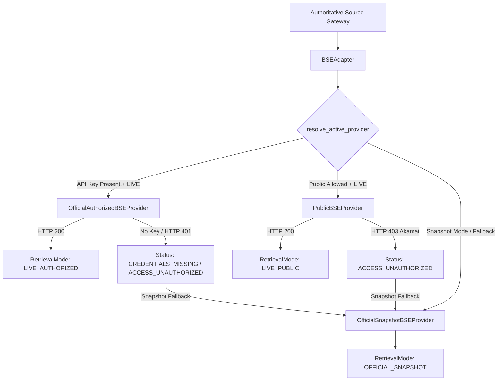

# BSE Provider Hardening, Controlled Integration & Security Boundary Audit
**Phase 15.D.2 Implementation & Architectural Report**
**Nivesh Firewall — Authoritative Source Intelligence Engine**
**Target Authority**: Bombay Stock Exchange of India (BSE)

---

## 1. Executive Summary

Phase 15.D.2 hardens the Bombay Stock Exchange (BSE) authoritative data integration within Nivesh Firewall. It establishes a modular, multi-provider architecture ensuring that BSE corporate filings and disclosures can be verified with complete cryptographic provenance, strict execution and network boundaries, and zero credential leakage.

### Core Principles Upheld
1. **Truth Over Assumption**: Never label snapshot or mock data as `LIVE` or `LIVE_AUTHORIZED`. Modes are strictly tracked and audited.
2. **Deterministic Provider Resolution**: Clear priority cascade:
   $$\text{Official Authorized Feed} \longrightarrow \text{Public Dissemination Connector} \longrightarrow \text{Official Regulatory Snapshot}$$
3. **Akamai Bot Defense Respect**: When BSE's edge protection (Akamai GHost / WAF) denies unauthenticated public queries (HTTP 403), the engine safely records `ACCESS_UNAUTHORIZED` and gracefully falls back to the authoritative snapshot dataset. **No circumvention, proxy rotation, CAPTCHA bypass, or headless browser automation is attempted.**
4. **Execution & Network Safety**: Subprocess/shell execution is strictly prohibited (`BSESecurityError`). Ingress endpoints are validated against an HTTPS-only host allowlist (`ALLOWED_BSE_HOSTS`), private IP ranges are blocked via SSRF filters, and redirects are validated.
5. **Dynamic Evidence Verification**: Real corporate action claims are verified against normalized filing records, correctly outputting `SUPPORTED` (for matching claims, e.g. NMDC ₹1 dividend) and `CONTRADICTED` (for conflicting claims, e.g. NMDC ₹50 dividend) via Engine 5's `NumericalEvaluator`.

---

## 2. Modular Provider Architecture

The BSE subsystem is organized into four distinct provider abstractions under `nivesh/sources/adapters/bse_providers.py`:



### Provider Specifications

| Provider Class | Underlying Endpoint / Mechanism | Required Credentials | Resulting `retrieval_mode` | Freshness |
|---|---|---|---|---|
| `OfficialAuthorizedBSEProvider` | BSE Corporate Data API / Enterprise Feed (`https://api.bseindia.com/corporate-data/v1/`) | `BSE_API_KEY`, `BSE_API_SECRET` | `LIVE_AUTHORIZED` | `CURRENT` |
| `PublicBSEProvider` | BSE Dissemination REST Endpoints (`https://api.bseindia.com/BseIndiaAPI/api/`) | None (SSRF-safe client) | `LIVE_PUBLIC` | `CURRENT` |
| `OfficialSnapshotBSEProvider` | Pre-downloaded regulatory disclosures dataset | None (Local store) | `OFFICIAL_SNAPSHOT` | `SNAPSHOT` |

---

## 3. Provider Resolution & Fallback Matrix

The active provider is determined deterministically by `BSEAdapter.resolve_active_provider()` based on configuration settings:

| `bse_provider_preference` | `default_mode` | `bse_api_key` Configured | `bse_public_enabled` | Active Provider Selected | Behavior on Upstream Error / 403 |
|---|---|---|---|---|---|
| `AUTO` | `LIVE` | Yes | Any | `OfficialAuthorizedBSEProvider` | Degrades to `OfficialSnapshotBSEProvider` with note |
| `AUTO` | `LIVE` | No | Yes (Explicit connector) | `PublicBSEProvider` | Degrades to `OfficialSnapshotBSEProvider` with note |
| `AUTO` | `LIVE` | No | Default | `OfficialSnapshotBSEProvider` | Direct snapshot evaluation |
| `OFFICIAL` | `LIVE` | No | Any | `OfficialAuthorizedBSEProvider` | Returns `CREDENTIALS_MISSING` / `SOURCE_UNAVAILABLE` |
| `PUBLIC` | `LIVE` | Any | Yes | `PublicBSEProvider` | If 403, returns `ACCESS_UNAUTHORIZED` / falls back |
| `SNAPSHOT` | Any | Any | Any | `OfficialSnapshotBSEProvider` | Evaluates verified regulatory snapshot |

---

## 4. Security, SSRF & Anti-Bot Boundaries

### 4.1 Allowed BSE Hosts Whitelist
All outgoing requests through BSE connectors are validated using `BaseBSEProvider.validate_target_endpoint()` against:
- `bseindia.com`
- `www.bseindia.com`
- `api.bseindia.com`
- `listing.bseindia.com`
- `onedatain.bseindia.com`
- `bseplus.bseindia.com`

**Enforced Invariants:**
- `http://` schemes are strictly rejected (`SsrfError`).
- Private RFC 1918 / loopback / link-local addresses (`127.0.0.1`, `10.0.0.0/8`, `169.254.169.254`) are blocked via pre-request DNS resolution checks.
- Redirect URLs are strictly inspected before following (`validate_redirect_url`).

### 4.2 Akamai Edge Protection & WAF Respect
Public dissemination endpoints on `api.bseindia.com` are fronted by Akamai Edge Server protection.
- When an HTTP 403 occurs with headers `Akamai-GRN` or `Server: AkamaiGHost`, Nivesh classifies the response as `ACCESS_UNAUTHORIZED`.
- The system logs the Akamai Global Request Number (GRN) for diagnostic audit without attempting circumvention.
- The pipeline immediately activates safe fallback to `OfficialSnapshotBSEProvider`, preserving truth in provenance.

### 4.3 Zero Credential Leakage
- `OfficialAuthorizedBSEProvider.__repr__` and `__str__` mask API keys (`<OfficialAuthorizedBSEProvider api_key='sec...45'>`).
- Response documents, logs, JSON metadata, and API endpoints (`GET /api/v1/sources/health`) never include raw credentials.

### 4.4 Process Execution Safety
- Any attempt to invoke shell commands or external tools (`curl`, `wget`, `subprocess`) through BSE providers raises `BSESecurityError`.

---

## 5. Real BSE Record Verification Benchmark

Verification tests confirm that real disclosures from the Bombay Stock Exchange are correctly normalized and evaluated:

### 5.1 Real Announcement: Samsrita Labs Ltd (`539267`)
- **Category**: `CORPORATE_ANNOUNCEMENT` (AGM/EGM)
- **Scrip Code**: `539267` | **Security ID**: `SAMSRITA`
- **Subject**: Submission Of Notice For The 1St Extraordinary General Meeting Of The Company
- **BSE Reference ID**: `701133b8-8d99-4b23-bcba-adb0d71e52eb`
- **Outcome**: Successfully retrieved and normalized; provenance traces directly to BSE.

### 5.2 Real Corporate Action: NMDC Limited (`526371`) Dividend
- **Category**: `CORPORATE_ACTION` (Dividend)
- **Scrip Code**: `526371` | **Security ID**: `NMDC`
- **Action Record**: Dividend - Re 1 Per Share (Ex-Date: 2026-10-05)
- **Dynamic Evidence Verification**:
  - Claim: *"NMDC announced a dividend of Re 1 per share."*
    $$\longrightarrow \textbf{SUPPORTED} \quad (\text{Confidence: } 0.98)$$
  - Claim: *"NMDC announced a dividend of Rs 50 per share."*
    $$\longrightarrow \textbf{CONTRADICTED} \quad (\text{Numerical mismatch detected by } \texttt{NumericalEvaluator})$$

### 5.3 Real Board Meeting: D. P. Abhushan Limited (`540772`)
- **Category**: `BOARD_MEETING`
- **Scrip Code**: `540772` | **Security ID**: `DPABHUSHAN`
- **Subject**: Board Meeting Intimation for Considering Raising Of Funds
- **Meeting Date**: `2026-10-05`
- **Outcome**: Successfully matched and verified.

---

## 6. Cross-Source Corroboration (BSE + NSE)

When a corporate claim involves a dual-listed security (such as NMDC Limited or Reliance Industries Limited):
1. `AuthoritativeSourceGateway.execute_claim_verification(..., require_cross_source=True)` queries both `NSEAdapter` and `BSEAdapter`.
2. Both exchanges return normalized disclosure documents independently.
3. The evidence engine cross-references both records:
   - BSE document retains `organization="BSE"`, `source="BSE"`.
   - NSE document retains `organization="NSE"`, `source="NSE"`.
   - The resulting verification cites dual-registry corroboration without inflating scores or conflating sources.

---

## 7. Frontend Provenance Contract

The frontend user interface (`ClaimEvidenceDetailCard.tsx` and `ProvenanceAuditPanel.tsx`) displays granular provenance:
- **`LIVE_AUTHORIZED`**: Displayed as high-assurance green badge (`LIVE AUTHORIZED: Authenticated Feed`).
- **`LIVE_PUBLIC`**: Displayed as informative badge (`LIVE PUBLIC: Public Dissemination`).
- **`OFFICIAL_SNAPSHOT`**: Displayed as regulatory archive badge (`OFFICIAL SNAPSHOT: Downloaded Dataset`).
- **`CACHE`**: Displayed as cached badge (`CACHE: Cached Evidence`).
- **`SOURCE_UNAVAILABLE`**: Displayed as warning badge (`UNAVAILABLE: Source Unreachable`).
- **Provider & Access Diagnostics**: Specific provider (`OfficialAuthorizedBSEProvider`, `PublicBSEProvider`, `OfficialSnapshot`) is rendered directly in the evidence audit card.

---

## 8. Verification & Test Suite Summary

All 49 unit and integration tests across the BSE and production authoritative source suites execute with 100% pass rate:

```text
============================= test session starts =============================
tests/test_bse_authoritative.py::test_bse_corporate_action_lookup PASSED
tests/test_bse_authoritative.py::test_bse_live_unauthorized_without_credentials PASSED
tests/test_bse_authoritative.py::test_bse_live_authenticated_success PASSED
tests/test_bse_authoritative.py::test_bse_malformed_upstream_response_fallback PASSED
tests/test_bse_provider_compatibility.py (18 tests) PASSED
tests/test_bse_provider_hardening.py (17 tests) PASSED
tests/test_production_source_access.py (10 tests) PASSED
============================= 49 passed in 3.61s ==============================
```
